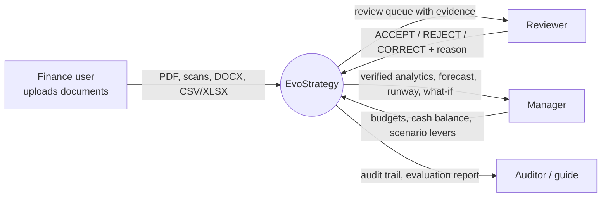
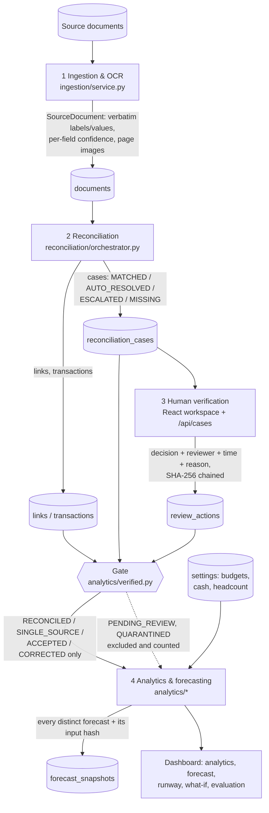
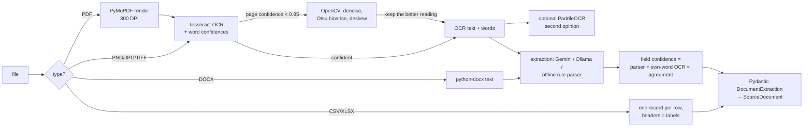
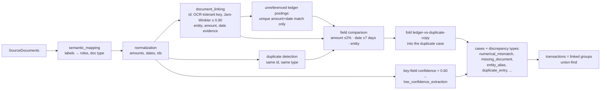
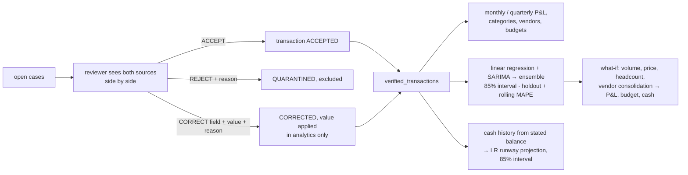

# EvoStrategy — Data Flow Diagrams

These match the code as implemented (module names in brackets). GitHub renders the
Mermaid blocks as diagrams.

## Level 0 — context

Everything runs on one local machine; no data leaves it unless an optional cloud
LLM (Gemini) is switched on.

## Level 1 — the four stages and the gate

## Level 2a — Stage 1 ingestion

## Level 2b — Stage 2 reconciliation

## Level 2c — Stage 3 verification and Stage 4

